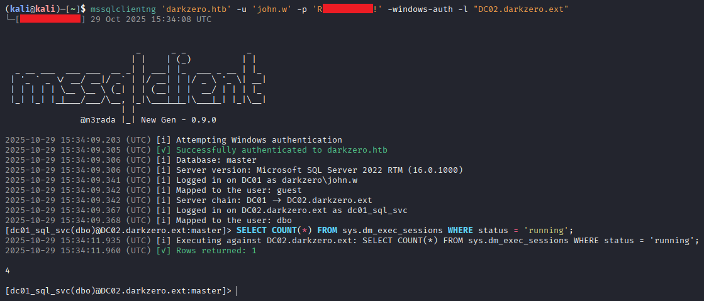

Enhanced version of impacket's `mssqlclient.py`. It lets you interact with Microsoft SQL Server (MS SQL / MSSQL) servers and their linked instances, impersonating any account encountered along the way, without requiring complex T-SQL queries.


<p align="center">
    
</p>

> [!TIP]
> If you have only access to a MS SQL instance through your implant/beacon, use [MSSQLand](https://github.com/n3rada/MSSQLand), the `C#` version built with assembly execution in mind. 

## 📦 Installation

To install `mssqlclient-ng`, you can use `pip`, `pip3` or `pipx`. Either from `pypi` repository or from `GitHub` source. Prefer using [`pipx`](https://pypa.github.io/pipx/), since it install Python applications in isolated virtual environments.

### From [PyPI](https://pypi.org/project/mssqlclientng/)

```bash
pipx install mssqlclientng
```

```bash
pip install mssqlclientng
```

### From GitHub

```bash
pipx install 'git+https://github.com/n3rada/mssqlclient-ng.git'
```

## Usage

```txt
                          _      _ _            _
                         | |    | (_)          | |
  _ __ ___  ___ ___  __ _| | ___| |_  ___ _ __ | |_
 | '_ ` _ \/ __/ __|/ _` | |/ __| | |/ _ \ '_ \| __|
 | | | | | \__ \__ \ (_| | | (__| | |  __/ | | | |_
 |_| |_| |_|___/___/\__, |_|\___|_|_|\___|_| |_|\__|
                       | |
               @n3rada |_| New Gen - 0.9.0

usage: mssqlclientng [-h] [--version] [-P PORT] [-d DOMAIN] [-u USERNAME] [-p PASSWORD] [-H [LMHASH:]NTHASH] [-windows-auth] [-k] [--use-kcache] [--aesKey AESKEY [AESKEY ...]] [--kdcHost KDCHOST] [-db DATABASE] [-l LINKS] [-dc-ip ip address] [-target-ip ip address] [-q QUERY]
                     [-a ...] [--list-actions] [--prefix PREFIX] [--history] [--multiline] [--debug] [--log-level {TRACE,DEBUG,INFO,WARNING,ERROR,CRITICAL}]
                     host

Interract with Microsoft SQL Server (MS SQL | MSSQL) servers and their linked instances, without the need for complex T-SQL queries.

options:
  -h, --help            show this help message and exit
  --version             Show version and exit.

Target:
  host                  Target MS SQL Server IP or hostname.
  -P, --port PORT       Target MS SQL Server port (default: 1433).
  -d, --domain DOMAIN   Domain name
  -db, --database DATABASE
                        MSSQL database instance (default None)
  -l, --links LINKS     Comma-separated list of linked servers to chain (e.g., 'SQL02:user,SQL03,SQL04:admin')

Credentials:
  Options for credentials

  -u, --username USERNAME
                        Username (either local or Windows).
  -p, --password PASSWORD
                        Password
  -H, --hashes [LMHASH:]NTHASH
                        NT/LM hashes.
  -windows-auth         whether or not to use Windows Authentication (default False)

Kerberos:
  Options for Kerberos authentication

  -k, --kerberos        Use Kerberos authentication
  --use-kcache          Use Kerberos authentication from ccache file (KRB5CCNAME)
  --aesKey AESKEY [AESKEY ...]
                        AES key to use for Kerberos Authentication (128 or 256 bits)
  --kdcHost KDCHOST     FQDN of the domain controller. If omitted it will use the domain part (FQDN) specified in the target parameter

Connection:
  -dc-ip ip address     IP Address of the domain controller. If ommited it use the domain part (FQDN) specified in the target parameter
  -target-ip ip address
                        IP Address of the target machine. If omitted it will use whatever was specified as target. This is useful when target is the NetBIOS name and you cannot resolve it

Actions:
  Actions to perform upon successful connection.

  -q, --query QUERY     T-SQL command to execute upon successful connection.
  -a, --action ...      Action to perform upon successful connection, followed by its arguments.
  --list-actions        List all available actions and exit.

Advanced Options:
  Additional advanced or debugging options.

  --prefix PREFIX       Command prefix for actions.
  --history             Enable persistent command history (stored in temporary folder).
  --multiline           Enable multiline input mode.
  --debug               Enable debug logging (shortcut for --log-level DEBUG).
  --log-level {TRACE,DEBUG,INFO,WARNING,ERROR,CRITICAL}
                        Set the logging level explicitly (overrides --debug).

```


### Chain Through Linked Servers

Avoid typing out all those **[RPC Out](https://learn.microsoft.com/fr-fr/sql/t-sql/functions/openquery-transact-sql)** or **[OPENQUERY](https://learn.microsoft.com/fr-fr/sql/t-sql/functions/openquery-transact-sql)** calls manually:

```bash
mssqlclientng SQLDEV.box -u 'jacquard' -p 'FQqU^XQ-*|xcv' -windows-auth -l "SQL02,SQL03:admin,SQL04"
```


## 🤝 Contributing 

Contributions are welcome and appreciated! Whether it's fixing bugs, adding new features, improving the documentation, or sharing feedback, your effort is valued and makes a difference.
Open-source thrives on collaboration and recognition. Contributions, large or small, help improve the tool and its community. Your time and effort are truly valued. 

Here, no one will be erased from Git history. No fear to have here. No one will copy-paste your code without adhering to the collaborative ethos of open-source.

## 🙏 Acknowledgments

- Built upon [Impacket](https://github.com/fortra/impacket), based on the core [tds.py](https://github.com/fortra/impacket/blob/master/impacket/tds.py).
- OOP design is really tied to [MSSQLand](https://github.com/n3rada/MSSQLand).
- Terminal interface powered by [prompt_toolkit](https://github.com/prompt-toolkit/python-prompt-toolkit).

## ⚠️ Disclaimer

**This tool is provided strictly for defensive security research, education, and authorized penetration testing.** You must have **explicit written authorization** before running this software against any system you do not own.

This tool is designed for educational purposes only and is intended to assist security professionals in understanding and testing the security of SQL Server environments in authorized engagements.

Acceptable environments include:
- Private lab environments you control (local VMs, isolated networks).  
- Sanctioned learning platforms (CTFs, Hack The Box, OffSec exam scenarios).  
- Formal penetration-test or red-team engagements with documented customer consent.

Misuse of this project may result in legal action.
