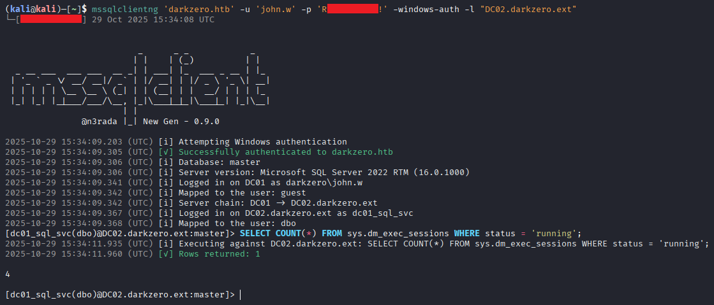

# ✈️ mssqlclient-ng

The Python counterpart to [MSSQLand](https://github.com/n3rada/MSSQLand). `mssqlclient-ng` is built for interacting with [Microsoft SQL Server](https://en.wikipedia.org/wiki/Microsoft_SQL_Server) during your red team activities or any security audit. Designed to run from an external position, it allows you to pave your way across multiple linked servers and impersonate whoever you can along the way, emerging from the last hop with any desired action.


<p align="center">
    
</p>

It supports NTLM, Kerberos, and pass-the-hash authentication natively through [Impacket](https://github.com/fortra/impacket)'s TDS implementation, and can handle [NTLM relaying](https://en.wikipedia.org/wiki/NTLM#Security_concerns) 🔄

> [!TIP]
> If you have access to a MS SQL instance only through your implant/beacon, use [MSSQLand](https://github.com/n3rada/MSSQLand), the `C#` version built with assembly execution in mind.

> [!NOTE]
> Do not forget the basics. During a security assessment, it is sometimes easier to use [SQL Server Management Studio (SSMS)](https://learn.microsoft.com/en-us/ssms/).

## 📦 Installation

Prefer using [`uv`](https://docs.astral.sh/uv/), a fast Python package manager that installs tools in isolated environments. Alternatively, [`pipx`](https://pypa.github.io/pipx/) or `pip` work as well.

### With [uv](https://docs.astral.sh/uv/) (recommended)

[`uv tool install`](https://docs.astral.sh/uv/guides/tools/#installing-tools) persistently installs the tool and adds it to your `PATH`, similar to `pipx`:

**From [PyPI](https://pypi.org/project/mssqlclient-ng/):**

```bash
uv tool install mssqlclient-ng
```

**From GitHub (latest):**

```bash
uv tool install git+https://github.com/n3rada/mssqlclient-ng.git
```

After installation, `mssqlclient-ng` is available directly:

```bash
mssqlclient-ng --help
```

To upgrade later:

```bash
uv tool upgrade mssqlclient-ng
```

> [!TIP]
> You can also run `mssqlclient-ng` **without installing** it using [`uvx`](https://docs.astral.sh/uv/guides/tools/#running-tools) (alias for `uv tool run`), which creates a temporary isolated environment on the fly:
> ```bash
> uvx mssqlclient-ng --help
> uvx --from git+https://github.com/n3rada/mssqlclient-ng.git mssqlclient-ng --help
> ```

### With pipx or pip

```bash
pipx install mssqlclient-ng
# or from GitHub
pipx install 'git+https://github.com/n3rada/mssqlclient-ng.git'
```

```bash
pip install mssqlclient-ng
# or from GitHub
pip install 'git+https://github.com/n3rada/mssqlclient-ng.git'
```

## 🧸 Usage

```shell
mssqlclient-ng <host> [options] [--action <action> [action-args...]]
```

> [!NOTE]
> Omitting `--action` drops you into an interactive SQL shell with tab completion, command history, and built-in commands.

Format: `server:port/user@database` or any combination `server/user@database:port`.
- `server` (required) - The SQL Server hostname or IP
- `:port` (optional) - Port number (default: 1433, also common: 1434, 14333, 2433)
- `/user` (optional) - User to impersonate on this server ("execute as login")
  - Supports **cascading impersonation**: `/user1/user2/user3` executes `EXECUTE AS LOGIN = 'user1'; EXECUTE AS LOGIN = 'user2'; EXECUTE AS LOGIN = 'user3';`
  - Each `/user` pushes a new impersonation context onto the security stack
- `@database` (optional) - Database context (defaults to 'master' if not specified)

```shell
# Connection test only (no action, enters interactive shell)
mssqlclient-ng localhost -u sa -p password

# Windows authentication
mssqlclient-ng LAB-SQL01 -windows-auth -u 'DOMAIN\user' -p 'password'

# Execute specific action
mssqlclient-ng localhost -u sa -p password --action info
mssqlclient-ng localhost:1434@db03 -u sa -p password --action whoami

# Kerberos authentication
mssqlclient-ng LAB-SQL01 -k -dc-ip 10.0.0.1

# Pass-the-hash
mssqlclient-ng LAB-SQL01 -windows-auth -u admin -hashes :NTHASH

# With impersonation on the initial server
mssqlclient-ng LAB-SQL01/sa -windows-auth -u 'DOMAIN\user' -p 'password' --action whoami
```

### 🔗 Linked Servers Chain

Chain multiple SQL servers using the `-l` flag with **semicolon (`;`) as the separator**:

```shell
-l SQL01;SQL02/user;SQL03@database
```

> [!TIP]
> Avoid typing out all the **[RPC Out](https://learn.microsoft.com/fr-fr/sql/t-sql/functions/openquery-transact-sql)** or **[OPENQUERY](https://learn.microsoft.com/fr-fr/sql/t-sql/functions/openquery-transact-sql)** calls manually. Let the tool handle any linked servers chain with the `-l` argument, so you can focus on the big picture.

**Syntax:**
- **Semicolon (`;`)** - Separates servers in the chain
- **Forward slash (`/`)** - Specifies user to impersonate ("execute as login")
  - Supports **cascading impersonation**: `/user1/user2` executes sequential impersonations
- **At sign (`@`)** - Specifies database context
- **Brackets (`[...]`)** - Used to protect the server name from being split by our delimiters

**Examples:**
```shell
# Simple chain
-l SQL01;SQL02;SQL03

# With impersonation and databases
-l SQL01/admin;SQL02;SQL03/manager@clients

# Cascading impersonation (impersonate user1, then user2 on SQL01)
-l SQL01/user1/user2;SQL02;SQL03

# Mixed cascading (SQL01: user1→user2, SQL03: user3→user4→user5)
-l SQL01/user1/user2;SQL02;SQL03/user3/user4/user5@database

# Server names can contain hyphens, dots (no brackets needed)
-l SQL-01;SERVER.001;HOST.DOMAIN.COM

# Brackets only needed if server name contains delimiter characters
-l [SERVER;PROD];SQL02;[SQL03@clients]@clientdb
```

> [!NOTE]
> Port specification (`:port`) only applies to the initial host connection. Linked server chains (`-l`) use the linked server names as configured in `sys.servers`, not `hostname:port` combinations.

## 🔍 Discovery

`mssqlclient-ng` does not include built-in discovery like [MSSQLand does](https://github.com/n3rada/MSSQLand#-discovery) because your Linux attack box already has mature tools for this. Here are the common approaches:

### 📡 SQL Browser (UDP 1434)

Query the [SQL Server Browser service](https://learn.microsoft.com/en-us/sql/tools/configuration-manager/sql-server-browser-service) to enumerate instances, ports, and versions on a host:

```bash
nmap -sU -p 1434 --script ms-sql-info <target>
```

### 📂 SPN Enumeration (Active Directory)

Find SQL Server instances registered in AD via [Service Principal Names](https://learn.microsoft.com/en-us/sql/database-engine/configure-windows/register-a-service-principal-name-for-kerberos-connections) you can use any LDAP search tool.

### 🔌 Port Scanning

Once a target host is confirmed alive, validate SQL Server presence with TDS protocol handshake (not just TCP SYN):

```bash
# Common SQL Server ports with TDS validation
nmap -Pn -sS -p 1433,1434,14333,2433 --script ms-sql-info <target>

# Full scan for instances on non-standard ports (ephemeral range)
nmap -Pn -sS -p 1024-65535 --script ms-sql-info --open <target>
```

> [!TIP]
> Use `-Pn` to skip host discovery (the target is already known alive) and `-sS` for SYN scan to reduce noise. The `ms-sql-info` script performs a TDS pre-login handshake, confirming actual SQL Server instances rather than just open TCP ports.

## 🔄 NTLM Relay

mssqlclient-ng can act as an NTLM relay listener, capturing incoming authentication attempts and relaying them to a SQL Server target:

```shell
# Start relay listener and wait for an incoming authentication
mssqlclient-ng <target_sql_server> -r

# With SMB2 support and custom timeout
mssqlclient-ng <target_sql_server> -r -smb2support -t 120
```

Once a connection is relayed, you land in the interactive shell authenticated as the relayed user. Pair this with [PetitPotam](https://github.com/topotam/PetitPotam), [PrinterBug](https://github.com/dirkjanm/krbrelayx), or any coercion technique to relay machine accounts to SQL Server.

## ❓ Help

```shell
# Show all available options
mssqlclient-ng --help

# Show help for a specific action
mssqlclient-ng <host> -u sa -p password --action whoami --help
```

## 📸 Clean Output for Clean Reports

The tool's output, enriched with timestamps and valuable contextual information, is designed to produce visually appealing and professional results, making it ideal for capturing high-quality screenshots for any of your reports (e.g., customer deliverable, internal report, red team assessments).

All output tables are Markdown-friendly and can be copied and pasted directly into your notes without any formatting hassle.

## 🙏 Acknowledgments

- Built upon [Impacket](https://github.com/fortra/impacket), based on the core [tds.py](https://github.com/fortra/impacket/blob/master/impacket/tds.py).
- OOP design is really tied to [MSSQLand](https://github.com/n3rada/MSSQLand).
- Terminal interface powered by [prompt_toolkit](https://github.com/prompt-toolkit/python-prompt-toolkit).

## ⚠️ Disclaimer

**This tool is provided strictly for defensive security research, education, and authorized penetration testing.** You must have **explicit written authorization** before running this software against any system you do not own.

This tool is designed for educational purposes only and is intended to assist security professionals in understanding and testing the security of SQL Server environments in authorized engagements.

Acceptable environments include:
- Private lab environments you control (local VMs, isolated networks).  
- Sanctioned learning platforms (CTFs, Hack The Box, OffSec exam scenarios).  
- Formal penetration-test or red-team engagements with documented customer consent.

Misuse of this project may result in legal action.

## ⚖️ Legal Notice

Any unauthorized use of this tool in real-world environments or against systems without explicit permission from the system owner is strictly prohibited and may violate legal and ethical standards. The creators and contributors of this tool are not responsible for any misuse or damage caused.

Use responsibly and ethically. Always respect the law and obtain proper authorization.
